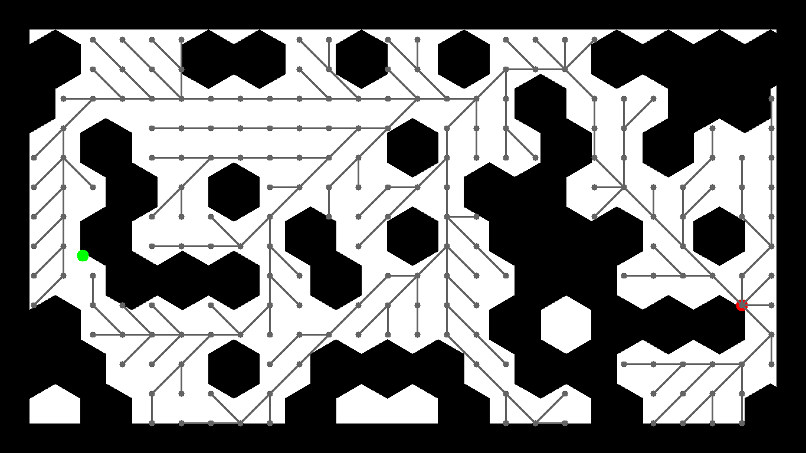

## A star
Took a long time debugging because the loop errored when self.queue ran out, tried different debug methods until I finally decided to handle the error to plot the traversing and realized the goal node isn't in the neighbor list by looking at the visualization. Other than that it was first try 

## RRT star
The only issue I made is not checking collision in the second get nearest pass, otherwise it's first try but the map isn't the same as reference so I assume the seed was different